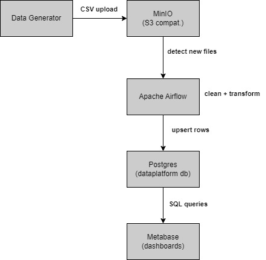

# Mini Data Platform

A production-grade, end-to-end data platform built with Docker Compose. It covers the full data lifecycle — ingestion, orchestration, storage, and visualisation — using entirely open-source tooling.

## Architecture



| Service | Image | Port | Purpose |
|---------|-------|------|---------|
| PostgreSQL | `postgres:15-alpine` | 5432 | Airflow metadata + processed data |
| MinIO | `minio/minio:latest` | 9000 / 9001 | S3-compatible raw-file ingestion |
| Apache Airflow | custom (2.8.1) | 8080 | Pipeline orchestration |
| Metabase | `metabase/metabase:v0.49.10` | 3000 | BI dashboards |

## Quick Start

### Prerequisites
- Docker >= 24 and Docker Compose v2 plugin
- 4 GB free RAM recommended

### 1 — Clone and run the setup script

```bash
git clone <repo-url>
cd Mini_Data_Platform
bash scripts/setup.sh
```

The script builds all images, starts every service in dependency order, and prints service URLs when done.

### 2 — Manually (step by step)

```bash
cp .env.example .env          # review credentials

docker compose build
docker compose up -d postgres minio
docker compose run --rm minio-setup      # creates buckets
docker compose up airflow-init           # DB migrations + admin user
docker compose up -d airflow-webserver airflow-scheduler metabase
```

### 3 — Generate sample data

```bash
cd data_generator
pip install -r requirements.txt
python generate_data.py --rows 500
```

The generator uploads a timestamped CSV to the `sales-data` MinIO bucket. The Airflow DAG polls every 5 minutes and picks it up automatically, or you can trigger it manually from the Airflow UI.

## Service URLs

| Service | URL | Credentials |
|---------|-----|-------------|
| Airflow UI | http://localhost:8080 | admin / admin |
| MinIO Console | http://localhost:9001 | minioadmin / minioadmin |
| Metabase | http://localhost:3001 | set on first login |
| PostgreSQL | localhost:5432 | airflow / airflow |

## Airflow DAG — `sales_data_pipeline`

**File:** [dags/sales_pipeline.py](dags/sales_pipeline.py)
**Schedule:** every 5 minutes

| Task | What it does |
|------|-------------|
| `detect_new_files` | Lists CSVs in `sales-data` bucket; filters files not yet in `processed_files` table |
| `process_and_load` | Downloads each CSV, cleans/transforms with pandas, upserts rows into `sales` table, archives file to `processed-data` bucket |

## PostgreSQL Schema

```sql
-- dataplatform database
sales           (order_id PK, customer, product, quantity, price, ...)
processed_files (filename PK, record_count, processed_at)
```

## Metabase Setup

1. Open http://localhost:3001 and complete the initial setup wizard.
2. Add a database connection:
   - **Type:** PostgreSQL
   - **Host:** `postgres`
   - **Port:** `5432`
   - **Database:** `dataplatform`
   - **User:** `dataplatform`  **Password:** `dataplatform`
3. Build questions/dashboards against the `sales` table.

Suggested KPIs:
- Revenue by region (bar chart)
- Daily order volume (line chart)
- Top 5 products by revenue
- Order status breakdown (pie chart)

## CI/CD — GitHub Actions

**File:** [.github/workflows/main.yml](.github/workflows/main.yml)

| Job | Trigger | What runs |
|-----|---------|-----------|
| `lint` | every push / PR | flake8 on DAGs and generator; `docker compose config` |
| `build` | after lint | builds the custom Airflow image |
| `integration-test` | after build | full end-to-end: postgres + minio -> data generator -> Airflow DAG -> PostgreSQL row-count check -> Metabase health |
| `deploy` | push to `main` only | `docker compose up -d` (simulates test-env deploy) |

## Environment Variables

Copy `.env.example` to `.env` and adjust for production.

| Variable | Default | Notes |
|----------|---------|-------|
| `AIRFLOW__CORE__FERNET_KEY` | sample key | **Generate a new one for production** |
| `AIRFLOW__WEBSERVER__SECRET_KEY` | `change-me...` | **Change in production** |
| `POSTGRES_PASSWORD` | `airflow` | Change in production |
| `MINIO_ROOT_PASSWORD` | `minioadmin` | Change in production |

Generate a Fernet key:
```bash
python -c "from cryptography.fernet import Fernet; print(Fernet.generate_key().decode())"
```

## Useful Commands

```bash
# Tail Airflow scheduler logs
docker compose logs -f airflow-scheduler

# Trigger DAG via CLI
docker compose exec airflow-webserver airflow dags trigger sales_data_pipeline

# Query sales data
docker compose exec postgres psql -U dataplatform -d dataplatform \
  -c "SELECT category, SUM(total_amount) FROM sales GROUP BY 1 ORDER BY 2 DESC;"

# Stop everything
docker compose down

# Wipe all data (volumes)
docker compose down -v
```

## Project Structure

```
Mini_Data_Platform/
├── docker-compose.yml          # full service topology
├── .env.example                # environment variable template
├── airflow/
│   ├── Dockerfile              # extends apache/airflow:2.8.1
│   └── requirements.txt        # boto3, pandas, psycopg2-binary
├── dags/
│   └── sales_pipeline.py       # ETL DAG
├── data_generator/
│   ├── generate_data.py        # synthetic sales data + MinIO upload
│   └── requirements.txt
├── config/
│   └── postgres/
│       └── init.sql            # creates databases, tables, indexes
├── scripts/
│   └── setup.sh                # one-shot bootstrap script
└── .github/
    └── workflows/
        └── main.yml            # CI/CD pipeline
```
